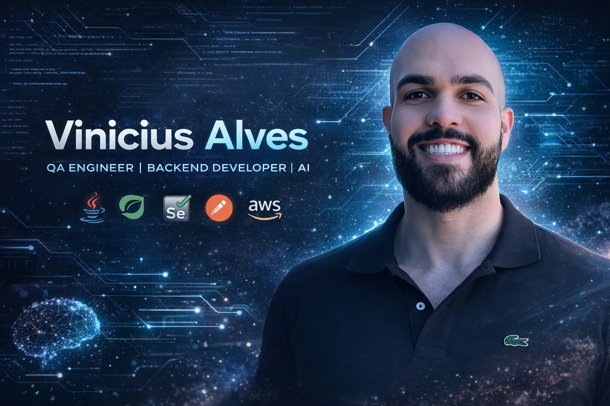

  

<h1 align="center">Vinicius Alves</h1>

  <strong>Senior QA Engineer | Backend Developer | AI Enthusiast</strong>

  Software Quality • API Testing • Test Automation • Backend with Java • AI applied to Software Engineering

---

## 👋 About me | Sobre mim

🇧🇷
Sou **Engenheiro de Qualidade de Software Sênior**, com experiência sólida em testes manuais, funcionais e automatizados para aplicações **Web, Android e iOS**.
Atualmente atuo no **Banco PAN** e venho expandindo minha atuação para **Desenvolvimento Backend com Java + Spring Boot** e **Inteligência Artificial aplicada à Engenharia de Software**.

Minha experiência inclui:

* Automação de testes Web e API
* CI/CD e ambientes ágeis
* Observabilidade e monitoramento
* Qualidade de software com foco em confiabilidade e escala

Também sou:

* Graduado em **Engenharia Mecatrônica**
* Tecnólogo em **Automação Industrial**
* MBA em **Digital Business**
* Cursando MBA em **Engenharia de Software pela USP**

🇺🇸
I’m a **Senior Software Quality Engineer** with strong experience in manual, functional and automated testing for **Web, Android and iOS** applications.
Currently, I work at **Banco PAN** and I’m expanding my path into **Backend Development with Java + Spring Boot** and **Artificial Intelligence applied to Software Engineering**.

My experience includes:

* Web and API test automation
* CI/CD and agile environments
* Observability and monitoring
* Software quality focused on reliability and scalability

I also hold:

* A degree in **Mechatronics Engineering**
* A degree in **Industrial Automation Technology**
* An MBA in **Digital Business**
* An ongoing MBA in **Software Engineering at USP**

---

## 🚀 Tech Stack

  

---

## 🔧 QA, Tools & Platforms

* **Test Automation:** Cypress, Selenium, Robot Framework
* **API Testing:** Postman, Swagger, Rest Assured
* **Observability & Monitoring:** Grafana, Kibana, Firebase, New Relic, Runscope
* **CI/CD:** Jenkins, Azure DevOps
* **Version Control:** Git, GitHub, Azure Repos, Bitbucket
* **Databases:** MySQL, PL/SQL, PostgreSQL
* **Agile & Collaboration:** Jira, ALM, Teams, Scrum

---

## 🧠 Current Focus | Foco atual

* Backend Development with **Java 21 + Spring Boot**
* **AI applied to Software Testing**
* **API Automation** with Rest Assured + Cucumber
* Building scalable, reliable and testable systems
* Strengthening my path toward international opportunities

---

## 📌 Featured Projects

### 🔹 API Spring Boot

REST API built with **Java 21 + Spring Boot**, following backend best practices such as layered architecture, clean code and scalability.

### 🔹 API Test Automation

Test automation framework using **Java + Rest Assured + Cucumber (BDD)** for reliable and maintainable API validation.

### 🔹 AI Test Generator

Project focused on using **Artificial Intelligence** to generate API test scenarios, prompts and productivity accelerators for software teams.

---

## 🏆 Highlights

* Senior QA Engineer
* Strong experience in software quality for Web, Mobile and APIs
* Test automation mindset with focus on reliability and scalability
* Experience in CI/CD and agile environments
* Strategic transition into Backend + AI
* Technical background combined with business vision

---

## 📊 GitHub Stats

  
  

  

---

## 📫 Contact | Contato

  
  

---

## 🎯 Career Goals | Objetivos de carreira

🇧🇷
Meu objetivo é atuar em projetos de alto impacto, unindo minha experiência sólida em **Qualidade de Software** com **Desenvolvimento Backend** e **Inteligência Artificial**, construindo uma carreira cada vez mais forte em ambiente internacional.

🇺🇸
My goal is to work on high-impact projects, combining my strong **Software Quality** background with **Backend Development** and **Artificial Intelligence**, building an increasingly strong international career.

---

  <strong>Always evolving. Always building. Always improving quality.</strong>

